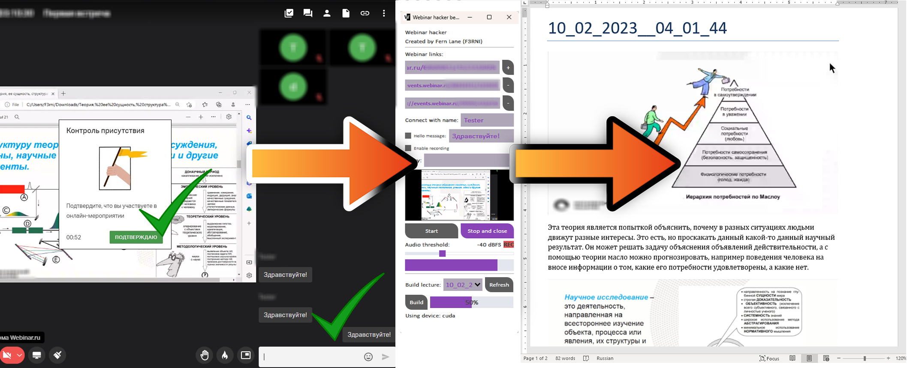

# Webinar-hacker
## Automatic lectures recording and transcription on the webinar.ru platform
## Автоматическая запись и транскрибирование лекций из платформы webinar.ru
<div style="width:100%;text-align:center;">
    <p align="center">
        <a href="https://github.com/F33RNI/Webinar-hacker/releases"></a>
    </p>
    <p align="center">
        
        <a href="https://soundcloud.com/f3rni"></a>
        <a href="https://www.youtube.com/@F3RNI"></a>
    </p>
</div>
<div style="width:100%;text-align:center;">
    <p align="center">
        
    </p>
</div>

----------

## Возможности

- Автоматический вход по ссылке с указанным именем, ожидание начала мероприятия
- Автоматическое написание приветственного сообщения в чат
- Автоматическое блокирование микрофона и камеры
- Автоматическое блокирование всплывающих окон и диалогов
- Автоматическое подтверждение присутствия
- Автоматическая активность путём периодического фокусирования на чате
- Автоматическая запись звука с возможностью задания порога чувствительности
- Автоматическое сохранение скриншотов
- Транскрибирование аудио в текст
- Сопоставление скриншотов и транскрибированного текста в документ формата `.docx`

----------

## Как запустить и пользоваться

- Скачайте и распакуйте архив последней версии Webinar-hacker: https://github.com/F33RNI/Webinar-hacker/releases/latest
- Скачайте и установите Google Chrome, если у вас его нет: https://www.google.com/chrome/
- Запустите приложение, используя файл `Webinar-hacker.exe`
- Вставьте ссылку на мероприятие в поле `Webinar link:`
- Укажите имя, с которым нужно подключиться в поле `Connect with name:`
- Укажите приветственное сообщение, которое необходимо отправить в чат после начала мероприятия в поле `Hello message:`
- Укажите, нужно ли записывать это мероприятие для последующего транскрибирования
- Нажмите кнопку `Start` и дождитесь открытия браузера
- Готово! Вход, запись и выход будут выполнены автоматически. Чтобы закрыть браузер раньше, нажмите на кнопку `Stop and close`
- **Важно! Не закрывайте окно браузера напрямую. Используйте кнопку Stop and close!**

После завершения мероприятия, записанный материал можно транскрибировать в `.docx` документ с картинками:
- Для этого обновите список записей нажав на кнопку `Refresh`
- Выберите из списка нужную запись
- Укажите, нужно ли исправлять орфографию и дополнять знаками препинания
- Нажмите на кнопку `Build`. После окончания процесса, будет показано окно с путём сохранения конечного документа
- **Важно! Процесс сборки лекции может занимать длительное время! (на слабых устройствах может быть равно или более времени записанного материала) Не закрывайте приложение до разблокировки кнопок**
- Для ускорения процесса транскрибирования, установите CUDA: https://developer.nvidia.com/cuda-downloads и убедитесь что в консоли при запуске сборки есть сообщение `INFO     Using device: cuda`

----------

## Настройки и файл настроек

- Настройки Webinar-hacker хранятся в файле `settings.json`
- Настройки `"gui_link", "gui_name", "gui_hello_message", "gui_hello_message_enabled", "gui_recording_enabled", "gui_proxy", "gui_audio_threshold_dbfs", "gui_spell_correction_enabled", "gui_punctuation_correction_enabled"` редактируются при помощи элементов интерфейса в реальном времени
- Для изменения других настроек, закройте приложение, откройте данный файл в текстовом редакторе, измените нужные параметры и откройте приложение заново
- **Важно! Webinar-hacker не проводит автоматическую проверку настроек. Если вы задали неверное значение, ошибка появится в неожиданный момент! Будьте внимательны при редактировании файла**

Текущий список настроек:
```json
{
    "screenshot_diff_threshold_percents": 5,
    "opencv_threshold": 10,
    "word_low_probability_threshold_percents": 90,
    "webinar_loop_interval_seconds": 5.0,
    "timestamp_format": "%d_%m_%Y__%H_%M_%S",
    "audio_chunk_size": 4096,
    "audio_recording_chunks_min": 6,
    "audio_wav_sampling_rate": 16000,
    "audio_wav_resampling_type": "soxr_mq",
    "paragraph_audio_distance_min_milliseconds": 2000,
    "recordings_directory_name": "recordings",
    "lectures_directory_name": "lectures",
    "audio_directory_name": "audio",
    "screenshots_directory_name": "screenshots",
    "spell_correction_dictionary": "ru_RU",
    "punctuation_correction_model": "Model_ru_punctuator_h256_lr0.02.pcl",
    "punctuation_correction_tokenizer": "tokenizers/punkt/russian.pickle",
    "lecture_picture_width_inches": 6.0,
    "lecture_font_size_pt": 12,
    "lecture_text_color": [
        0,
        0,
        0
    ],
    "speech_recognition_model": "jonatasgrosman/wav2vec2-large-xlsr-53-russian",
    "gui_link": "",
    "gui_name": "Tester",
    "gui_hello_message": "\u0417\u0434\u0440\u0430\u0432\u0441\u0442\u0432\u0443\u0439\u0442\u0435!",
    "gui_hello_message_enabled": true,
    "gui_recording_enabled": true,
    "gui_proxy": "",
    "gui_audio_threshold_dbfs": -40,
    "gui_spell_correction_enabled": true,
    "gui_punctuation_correction_enabled": true
}
```

----------

## Зависимости

- **wav2vec2-large-xlsr-53-russian**: https://huggingface.co/jonatasgrosman/wav2vec2-large-xlsr-53-russian
- **ru_punct**: https://github.com/gleb-skobinsky/ru_punct
- **LibreOffice** (словарь ru_RU): https://www.libreoffice.org/
- Другие зависимости и пакеты, указанные в файле `requirements.txt`

----------

## Запуск из исходников / сборка из исходников

- Подробных инструкции пока неть 🙃
- Но можно склонировать репозиторий `git clone https://github.com/F33RNI/Webinar-hacker`
- Установить пакеты `pip install -r requirements.txt --upgrade`
- Скопировать файлы `dict-ru/ru_RU.aff` и `dict-ru/ru_RU.dic` в папку `ПАПКА_PYTHON/Lib/site-packages/enchant/data/mingw64/share/enchant/hunspell/`
- И попробовать запустить приложение `python main.py`

----------

## Участие в разработке

- Хотите добавить что-то новое / исправить баг? Просто создайте пул-реквест!

----------

## P.S. Проект находится в стадии разработки!
